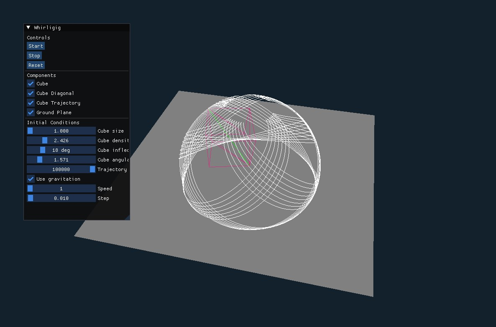
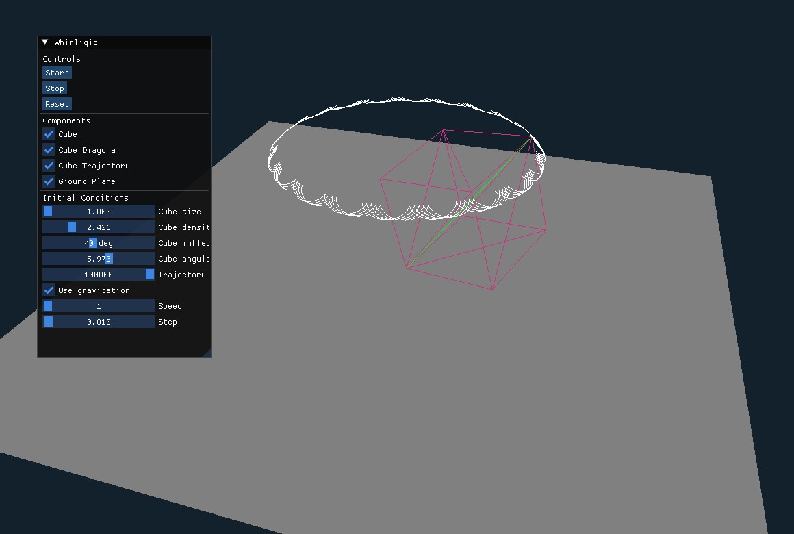
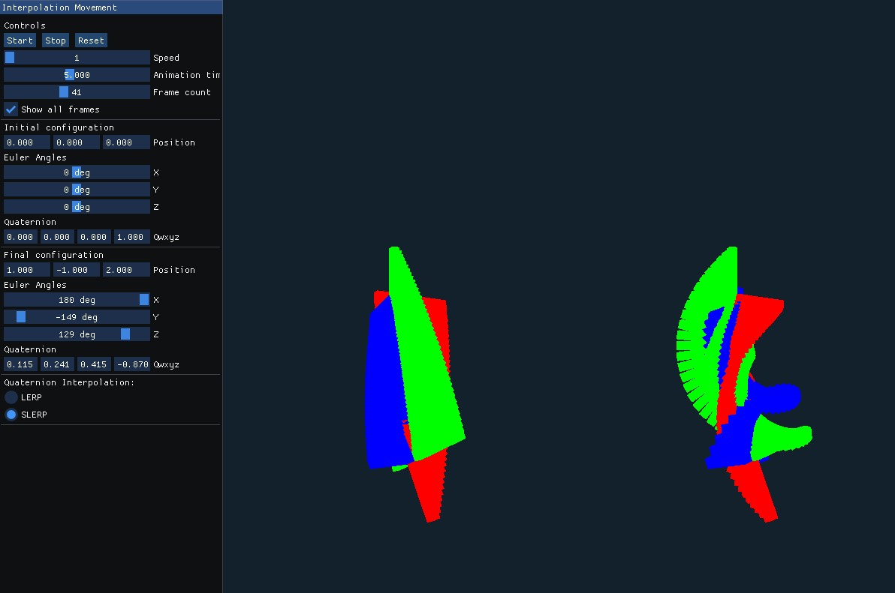
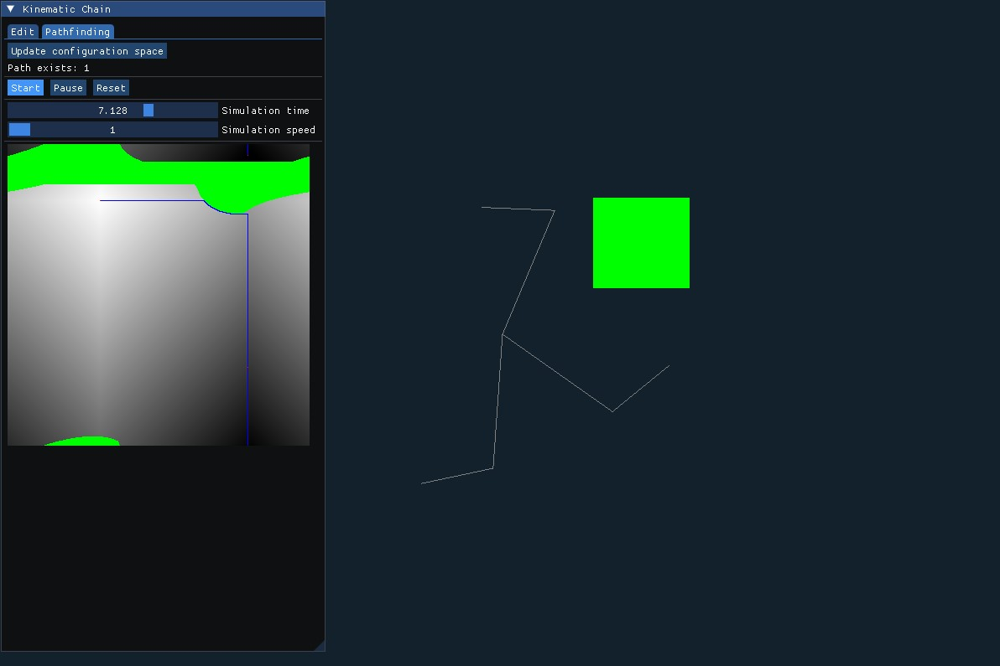
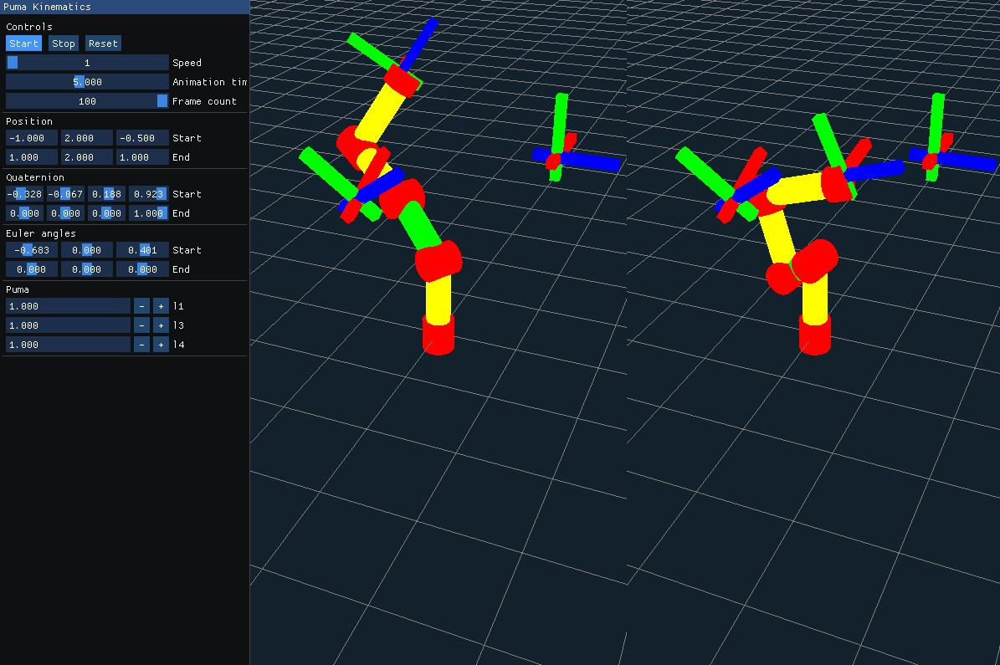
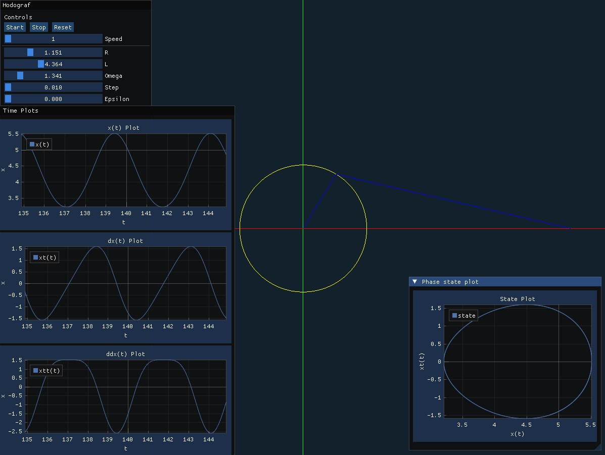
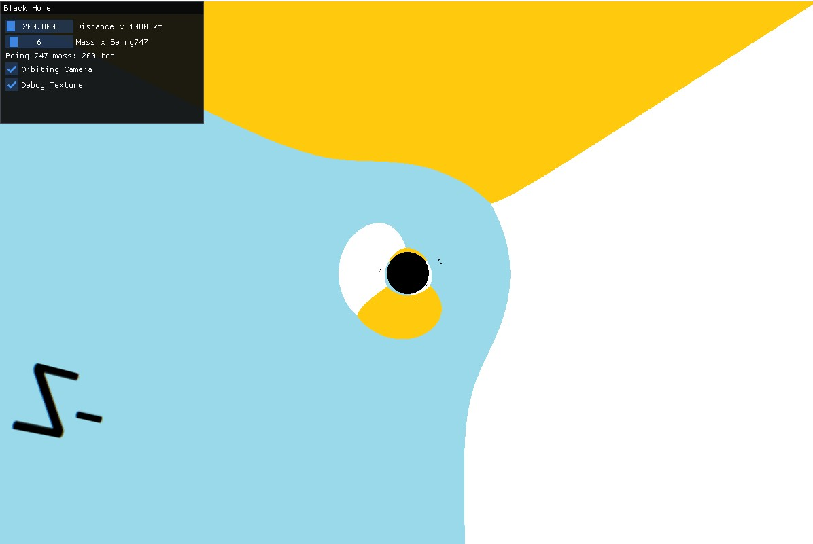

# Physics Simulation

## Table of Contents
1. [Overview](#overview)
2. [Physics Simulation: Whirligig](#physics-simulation-whirligig)
3. [Physics Simulation: Dynamic Deformation Simulation (Jelly)](#physics-simulation-dynamic-deformation-simulation-jelly)
4. [PUSN: Motion Interpolation](#pusn-motion-interpolation)
5. [PUSN: Pathfinding for a Planar Kinematic Chain](#pusn-pathfinding-for-a-planar-kinematic-chain)
6. [PUSN: Simulation of a Puma Robot](#pusn-simulation-of-a-puma-robot)
7. [PUSN: Hodograph](#pusn-hodograph)
8. [Geometric Modelling 2: Black Hole Simulation](#geometric-modelling-2-black-hole-simulation)

## Overview
This repository contains a collection of projects designed for Physics Simulation, Numerical Control Programming, and Geometric Modelling 2 courses. Each project focuses on different aspects of physics simulation, numerical control programming, and geometric modeling. Below are detailed descriptions of each project, including their features. 

## Physics Simulation: Whirligig

Simulation of the rotational motion of a cube attached to a corner.
The project showed the importance of precision in simulation parameters and highlighted how virtual environments can be powerful tools for visualizing theoretical concepts.

The rotational motion of a cube can be described using Euler's equations: 
- **IW, = N + (IW) • W** 
- **Q, = Q•W/2** 

where 
- **I** is the inertia tensor of the system relative to the corner.
- **N(t)** — moment of forces acting on the body, 
- **W(t)** — angular velocity, 
- **Q(t)** — quaternion of rotation. 

## Physics Simulation: Dynamic Deformation Simulation (Jelly)

This project focused on simulating the dynamic deformation of a 3D structure made of a Bezier cube, designed to behave like a "jelly." The project was completed as part of a laboratory exercise.

### Project Overview

The project involved simulating the movement and deformation of a flexible system consisting of 64 control points (masses) connected elastically to a rigid frame controlled by the user. The movement of control points was constrained within a parallelepiped, while the control frame's movement was unrestricted. 

### Features

- Simulated elastic movement of a 64-mass system within a bounded space.
- Provided user interaction for moving, rotating, and scaling the entire scene.
- Implemented collision detection and responses with boundary constraints.

[Jelly Simulation Video](https://github.com/user-attachments/assets/9a4e40e8-f88b-4bed-952a-f1316b8e4bb4)

## PUSN: Motion Interpolation

Comparison different methods of motion interpolation. Linear interpolation was used for position, while both Euler angles and quaternion interpolation was for rotation.

**Features:**
1. **Program Window:** The window was divided into two parts.
2. **User Configuration:** Users set or inputted two coordinate system configurations (initial and final) using either the mouse or keyboard. Positions are specified in degrees, and quaternions are input as real numbers.
3. **3D Animation:** Animated interpolation of both rotation and position between configurations.
4. **Shortest Path Rotation:** Rotation was interpolated along the shortest path.
5. **Real-time Animation:** Animation length was configurable and runs in real-time.
6. **Simultaneous Animations:** Both position and rotation interpolations were animated concurrently.
7. **Quaternion Interpolation:** The program allowed switching between linear and spherical quaternion interpolation.
8. **Frame Display Option:** Option to displayed all animation frames simultaneously, with the number of intermediate frames configurable by the user.

## PUSN: Pathfinding for a Planar Kinematic Chain

Implemented a simple algorithm for pathfinding in a 2D kinematic chain with two arms.

**Features:**
1. **Program Modes:** The program operates in two modes - editing and pathfinding.
2. **Editing Mode:**
   - Defined robot parameters (L1 and L2) and obstacles using the keyboard and mouse.
   - Set the robot's end effector to a clicked point in the workspace.
   - Displayed possible configurations or indicate if a position is unreachable due to obstacles.
3. **Configuration Space:** 
   - Built a grid of internal chain coordinates (α1 and α2) and discretize the configuration space.
   - Checked for obstacle intersections for each configuration.
   - Visualized the configuration space with a color-coded grid.
   - Allowed obstacle editing and update configuration space on user demand.
4. **Pathfinding Mode:**
   - Selected initial and final configurations by clicking points in the workspace.
   - Used the flood-fill algorithm to find a path in the configuration space.
   - Presented the result as an animation and a gradient-colored path in the configuration space.

## PUSN: Simulation of a Puma Robot

Implemented a method for solving the inverse kinematics problem for a Puma robot and visualize its movement from an initial to a final configuration.

**Features:**
1. **Program Window:** The window was divided into two parts.
2. **User Configuration:** Defined the initial and final positions of the Puma robot's end effector.
3. **Inverse Kinematics:** Solved the inverse kinematics problem for the given positions.
4. **Simultaneous Animations:**
   - First part: Interpolated internal coordinates.
   - Second part: Interpolated end effector position and solved the inverse kinematics for each interpolated position.
5. **Obstacle-free Scene:** The scene had no movement constraints.
6. **Robot Visualization:** Visualized the robot and its moving parts.
7. **Scene Rotation:** Allowed users to rotate the scene.
8. **Real-time Animation:** Animation length was configurable and independent of computer performance.

## PUSN: Hodograph

Implemented a program to visualize the hodograph of a planar kinematic chain with two arms.
Investigated the impact of small disturbances on the operation of a simple dynamic system (flywheel).

**Features:**
1. **Program Display:** The program displayed an animation of the system and animated plots of x(t), x'(t), and x''(t), where x represents the position of the piston in space. The piston was assumed to be a material point with y = 0, and the derivative wasa calculated numerically.
2. **Real-time Animation:** The primary animation of the flywheel proceeded in real-time.
3. **System Parameters:** The parameters of the system (angular velocity ω, wheel radius R, and flywheel arm length L) could be modified at any time during the program's operation.
4. **Phase Plot:** The program also displayed a phase plot x'(x).
5. **Program Window:** The window was divided into five parts: the animation view and four described plots.
6. **Plot Scaling:** The x(t), x'(t), and x''(t) plots could be rescaled along the Y-axis, while the x'(x) plot could be scaled along both the X and Y axes.
7. **Error Handling:** The program included an error ϵ(t) with a normal distribution, mean zero, and standard deviation ϵ0, where ϵ0 is a user-defined parameter. The error determines the variation in arm length, so L at any time t is L := L + ϵ(t).

## Geometric Modelling 2: Black Hole Simulation

Created a model of a black hole using the gravitational lensing effect. This was achieved by determining the Schwarzschild radius and the bending of light rays around a point mass.

From the analysis of rays arriving from infinity with a large collision parameter, it is clear that all bodies cause some bending of light rays. This effect is significant because the bending of light rays passing near the Sun is one of the most important experimental tests of general relativity. The bending of rays by galaxies is the basis for gravitational lensing, which will be discussed in the next chapter. The quantity of interest is the deflection angle δφu, which can be determined by calculating the integral, where:
- M is the mass of the body,
- b is the distance of the ray from the body,
- w is the infinitesimal angle.

**Algorithm:**
1. Ray-casting
2. Determine the distance between the cast ray and the black hole using the geometric method of determining the distance from a point to a line.
3. Determine the integration interval of the deflection angle using Newton's method to find f = 0.
4. Calculate the deflection angle by integrating using the trapezoidal method.
5. Determine the new direction of the ray after rotating by the calculated angle around the axis perpendicular to the cast ray.

**Links:**
- Inspiration: GitHub - tomasz-herman/BlackHole
- Source: James B. Hartle - GRAVITATION, p. 235
